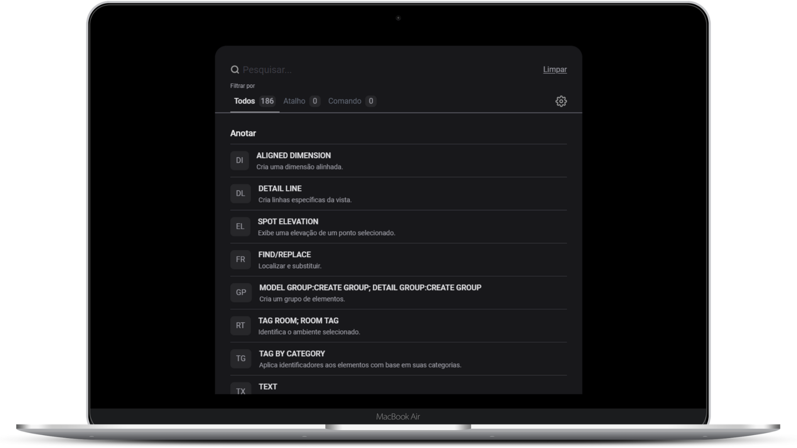

<h1 align="center">Revit | Comandos e atalhos</h1>

  <a href="#-tecnologias">Tecnologias</a>&nbsp;&nbsp;&nbsp;|&nbsp;&nbsp;&nbsp;
  <a href="#-projeto">Projeto</a>&nbsp;&nbsp;&nbsp;|&nbsp;&nbsp;&nbsp;
  <a href="#-licença">Licença</a>

  
  

  
  

## 🚀 Tecnologias

Esse projeto foi desenvolvido com as seguintes tecnologias:

- React
- TypeScript
- Vite

## 💻 Projeto

Revit - O RevitCommands é uma aplicação para buscar os atalhos e comandos do revit.

Acesse o projeto [nesse link](https://revitcommands.vercel.app)

## 📄 Licença

Esse projeto está sob a licença MIT. Veja o arquivo [LICENSE](LICENSE) para mais detalhes.

---

Feito com ❤ by [Matheus Gomes](<https://matheus7gs.me>) 👋🏻
